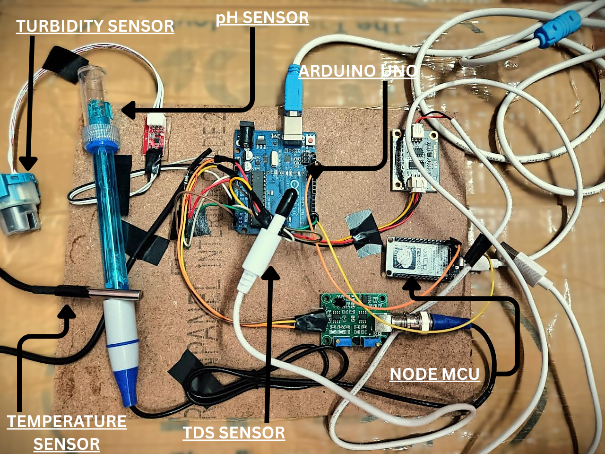
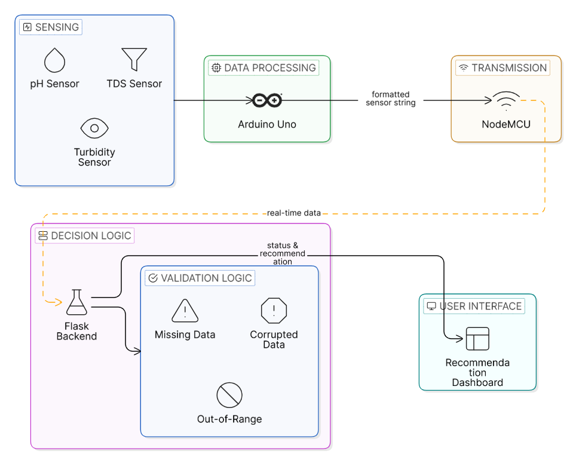
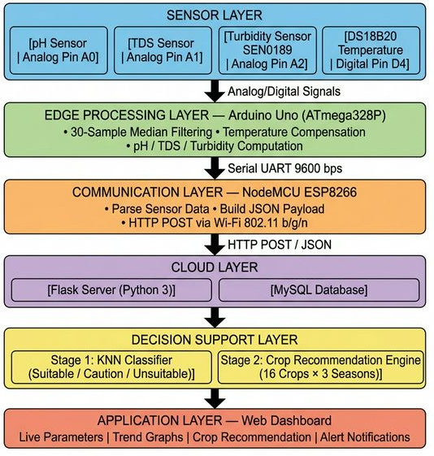
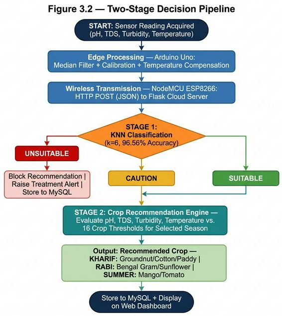
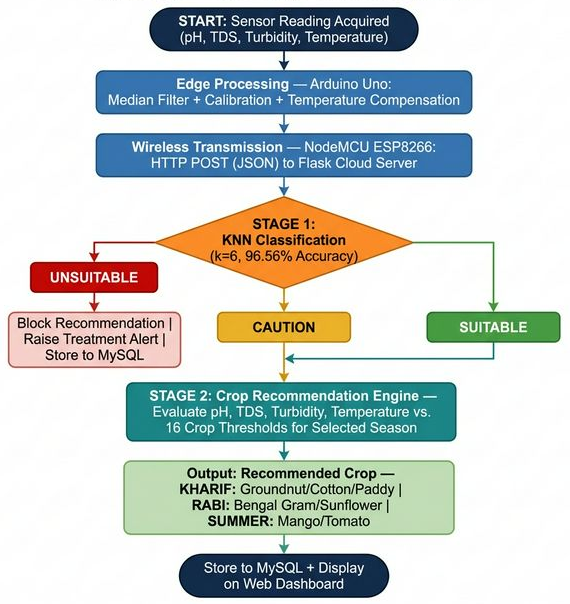
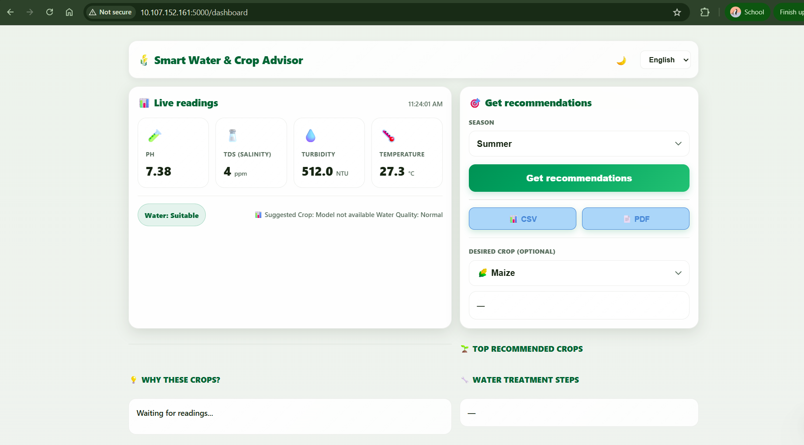
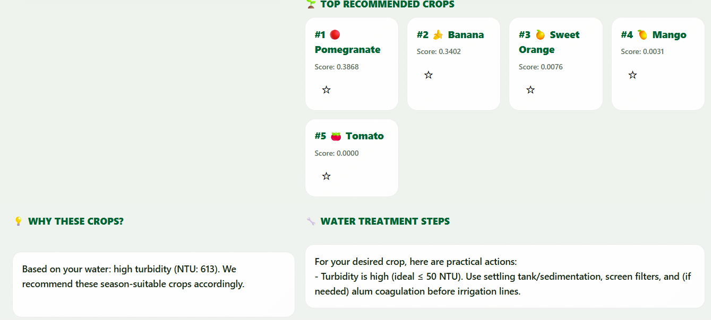
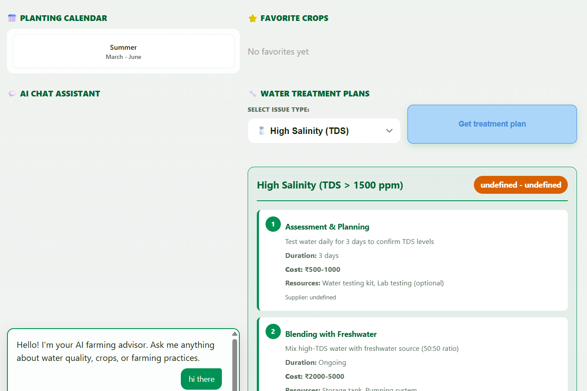
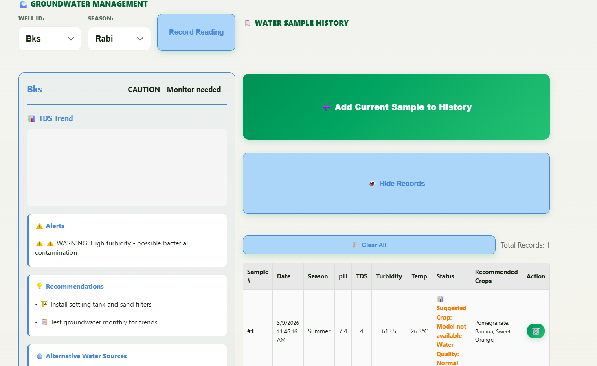

<div align="center">

# 🌱 Smart Water & Crop Advisor
### *An Intelligent Full-Stack IoT Platform for Real-Time Water Quality Monitoring, Crop Recommendation & Treatment Planning*

<p align="center">


</p>

### 📡 IoT • 🌐 Full Stack • 🤖 Machine Learning • 📊 Analytics • 🌾 Smart Agriculture

---

### ⭐ Academic Major Project

**IoT-Oriented Strategies in Agri-Aqua Systems**

Developed as a complete Full Stack IoT platform integrating **embedded hardware**, **wireless communication**, **cloud computing**, **machine learning**, and an **interactive web dashboard** to monitor irrigation water quality, evaluate suitability, recommend crops, and provide intelligent treatment plans.

</div>

---

# 📷 Project Preview

## Hardware Prototype

<p align="center">

</p>

---

## Complete System Architecture

<p align="center">

</p>

---

# 🌟 Overview

Agriculture depends heavily on the quality of irrigation water. Traditional testing methods are manual, time-consuming, and unsuitable for continuous monitoring. Farmers often make decisions without accurate water quality information, resulting in reduced crop yield, excessive fertilizer usage, and increased cultivation costs.

**Smart Water & Crop Advisor** addresses these challenges by integrating IoT sensors, cloud computing, machine learning, and full-stack web technologies into a unified intelligent platform.

The system continuously measures critical water quality parameters such as:

- 🌡 Temperature
- 💧 pH
- 🧂 Total Dissolved Solids (TDS)
- 🌊 Turbidity

These readings are transmitted wirelessly to a Flask cloud server where machine learning algorithms classify water quality, recommend suitable crops based on seasonal conditions, generate treatment plans, maintain historical records, and visualize everything through an interactive dashboard.

The result is a scalable decision-support platform capable of assisting farmers in making data-driven agricultural decisions.

---

# 🚀 Key Highlights

<table>

<tr>
<td width="50%">

## 🌱 Smart Farming

- Live water quality monitoring
- Automatic crop recommendations
- Seasonal crop intelligence
- Groundwater management
- Historical trend analysis

</td>

<td width="50%">

## 🤖 Artificial Intelligence

- K-Nearest Neighbors Classification
- Random Forest Crop Prediction
- Treatment Recommendation Engine
- AI Farming Assistant
- Intelligent Alerts

</td>

</tr>

<tr>

<td>

## 🌐 Full Stack Development

- Flask Backend
- REST APIs
- HTML/CSS/JavaScript
- Bootstrap UI
- Chart.js Analytics

</td>

<td>

## 📡 IoT Integration

- Arduino Uno
- NodeMCU ESP8266
- Wi-Fi Communication
- HTTP JSON Transfer
- Cloud Database

</td>

</tr>

</table>

---

# ✨ Core Features

## 📊 Real-Time Sensor Monitoring

✔ Live pH Monitoring

✔ Water Temperature

✔ Turbidity Analysis

✔ TDS Measurement

✔ Automatic Refresh

✔ Status Classification

---

## 🌾 Crop Recommendation Engine

- Season-based prediction
- Multiple crop suggestions
- Recommendation confidence
- Smart ranking
- Personalized selection

---

## 💧 Water Quality Assessment

The platform automatically classifies irrigation water into:

🟢 Suitable

🟡 Caution

🔴 Unsuitable

using a trained **K-Nearest Neighbors Machine Learning model**.

---

## 🤖 Intelligent Treatment Planner

Based on detected issues, the system automatically generates:

- Treatment procedures
- Estimated duration
- Required resources
- Cost estimation
- Preventive recommendations

---

## 📈 Dashboard Analytics

The dashboard provides:

- Interactive Charts
- Live Sensor Cards
- Historical Records
- CSV Export
- PDF Reports
- Trend Analysis
- Water Quality Insights

---

## 💬 AI Farming Assistant

An integrated AI chatbot assists users by answering agriculture-related queries including:

- Water quality
- Crop selection
- Soil conditions
- Irrigation
- Farming best practices

---

# 🎯 Why This Project?

Unlike conventional IoT monitoring systems that simply collect sensor data, this platform transforms raw environmental data into **actionable agricultural intelligence**.

It combines:

- IoT Hardware
- Wireless Communication
- Machine Learning
- Cloud Computing
- Full Stack Development
- Data Analytics
- Decision Support

into a single end-to-end intelligent ecosystem.

---

# 🏗 High-Level Architecture

<p align="center">

```text
             ┌───────────────────────┐
             │   Water Sensors       │
             │ pH • TDS • Temp • NTU │
             └──────────┬────────────┘
                        │
                Arduino UNO
                        │
                 Serial UART
                        │
                 NodeMCU ESP8266
                        │
                  HTTP / JSON
                        │
                  Flask Server
                        │
      ┌─────────────────┼─────────────────┐
      │                 │                 │
   MySQL          ML Models        REST APIs
      │                 │                 │
      └──────────────┬────────────────────┘
                     │
              Web Dashboard
                     │
             Farmer / Administrator

```

</p>

---

# 🖼 Architecture Gallery

<table>

<tr>

<td>

### System Architecture


</td>

<td>

### Layered Architecture



</td>

</tr>

<tr>

<td>

### Decision Pipeline



</td>

<td>

### ML Prediction Pipeline



</td>

</tr>

</table>

---

# 🛠 Technology Stack

| Category | Technologies |
|-----------|--------------|
| Programming | Python, C/C++ |
| Frontend | HTML5, CSS3, JavaScript, Bootstrap |
| Backend | Flask |
| Database | MySQL |
| Machine Learning | Scikit-Learn, KNN, Random Forest |
| Libraries | NumPy, Pandas |
| IoT | Arduino UNO, NodeMCU ESP8266 |
| Communication | Wi-Fi, HTTP, JSON |
| Visualization | Chart.js |
| IDE | Arduino IDE, VS Code, Jupyter Notebook |
| Version Control | Git, GitHub |

---

# 📚 Table of Contents

- Overview
- Features
- Architecture
- Technology Stack
- Project Structure
- Hardware Components
- Software Architecture
- Machine Learning
- Dashboard
- API Documentation
- Installation
- Usage
- Future Scope
- Contributors
- License

---

# 📂 Project Structure

```text
Smart-Water-Crop-Advisor/
│
├── 📂 arduino/
│   ├── sensor_readings/
│   ├── calibration/
│   └── esp8266_wifi/
│
├── 📂 flask_app/
│   ├── app.py
│   ├── routes.py
│   ├── models.py
│   ├── config.py
│   ├── recommendation.py
│   ├── treatment_engine.py
│   ├── ai_assistant.py
│   └── utils.py
│
├── 📂 templates/
│   ├── dashboard.html
│   ├── history.html
│   ├── recommendations.html
│   ├── treatment.html
│   └── chatbot.html
│
├── 📂 static/
│   ├── css/
│   ├── js/
│   ├── images/
│   └── icons/
│
├── 📂 ml_models/
│   ├── knn_water_classifier.pkl
│   ├── random_forest_crop.pkl
│   ├── train_knn.py
│   ├── train_random_forest.py
│   └── preprocess.py
│
├── 📂 datasets/
│   ├── water_quality.csv
│   ├── crop_dataset.csv
│   └── processed_data.csv
│
├── 📂 docs/
│   ├── hardware-setup.jpg
│   ├── system-architecture.png
│   ├── layer-architecture.png
│   ├── decision-pipeline.png
│   ├── ml-flowchart.png
│   └── dashboard/
│
├── requirements.txt
├── README.md
└── LICENSE
```

---

# ⚙️ Hardware Components

The hardware subsystem continuously captures real-time water quality parameters from multiple sensors and transmits them to the cloud platform through wireless communication.

| Component | Purpose |
|------------|---------|
| Arduino Uno | Primary sensor controller |
| NodeMCU ESP8266 | Wi-Fi communication module |
| pH Sensor | Measures acidity/alkalinity |
| TDS Sensor | Determines dissolved solids |
| Turbidity Sensor | Measures water clarity |
| DS18B20 | Water temperature measurement |

---

## 📸 Hardware Prototype

<p align="center">


</p>

---

# 🔌 Sensor Configuration

| Sensor | Connected To | Output |
|----------|-------------|---------|
| pH Sensor | A0 | Analog |
| TDS Sensor | A1 | Analog |
| Turbidity Sensor | A2 | Analog |
| DS18B20 | D4 | Digital |

---

# 🧠 Edge Computing

Instead of directly sending noisy sensor readings to the cloud, the Arduino performs local preprocessing.

### Operations performed

✅ Sensor Calibration

✅ Noise Reduction

✅ Median Filtering

✅ Temperature Compensation

✅ Analog-to-Digital Conversion

This significantly improves prediction accuracy while reducing communication overhead.

---

# 🌐 Communication Layer

The processed sensor readings are forwarded from the Arduino Uno to the NodeMCU ESP8266 using UART Serial Communication.

The ESP8266 then packages the readings into JSON format and transmits them over Wi-Fi to the Flask server using HTTP POST requests.

```text
Sensors
    │
Arduino UNO
    │
Serial UART
    │
NodeMCU ESP8266
    │
HTTP POST (JSON)
    │
Flask REST API
```

---

# 📦 JSON Payload Example

```json
{
  "ph": 7.38,
  "tds": 512,
  "turbidity": 24,
  "temperature": 27.3
}
```

---

# ☁️ Cloud Processing Pipeline

Once the Flask server receives sensor data, it performs multiple backend operations simultaneously.

```text
Receive JSON
      │
Validate Input
      │
Store in MySQL
      │
Run Water Classification
      │
Run Crop Recommendation
      │
Generate Treatment Plan
      │
Update Dashboard
```

---

# 🧱 Software Architecture

<p align="center">


</p>

---

# 🧩 Layered Architecture

## 🟦 Sensor Layer

Responsible for collecting real-world environmental parameters.

Collected Parameters

- pH
- Temperature
- Turbidity
- Total Dissolved Solids

---

## 🟩 Edge Processing Layer

Runs on Arduino Uno.

Responsibilities

- Sensor calibration
- Signal filtering
- Temperature compensation
- Analog processing

---

## 🟧 Communication Layer

Runs on NodeMCU ESP8266.

Responsibilities

- Parse sensor values
- Build JSON payload
- HTTP POST requests
- Wi-Fi connectivity

---

## 🟪 Cloud Layer

Runs on Flask.

Responsibilities

- REST APIs
- Authentication
- Data storage
- Model inference
- Dashboard rendering

---

## 🟨 Decision Support Layer

Responsible for intelligent prediction.

Contains

- KNN Water Classification
- Random Forest Crop Recommendation
- Treatment Recommendation Engine

---

## 🟥 Application Layer

User-facing interface providing

- Live Dashboard
- Crop Suggestions
- Analytics
- Reports
- History
- Alerts

---

# 🔄 Complete Data Flow

```text
Water Sample
      │
      ▼
Sensors
      │
      ▼
Arduino Uno
(Filter + Calibration)
      │
      ▼
NodeMCU ESP8266
(JSON + Wi-Fi)
      │
      ▼
Flask REST API
      │
      ▼
MySQL Database
      │
      ▼
Machine Learning Models
      │
      ▼
Decision Engine
      │
      ▼
Dashboard
      │
      ▼
Farmer
```

---

# 🧠 Machine Learning Pipeline

<p align="center">


</p>

---

# 🤖 Stage 1 — Water Suitability Classification

The first prediction stage evaluates the incoming water sample using a trained **K-Nearest Neighbors (KNN)** classifier.

### Input Features

- pH
- TDS
- Turbidity
- Temperature

### Output Classes

🟢 Suitable

🟡 Caution

🔴 Unsuitable

This stage acts as an intelligent screening process before crop recommendations are generated.

---

# 🌾 Stage 2 — Crop Recommendation

After successful water classification, a Random Forest model predicts the most suitable crops based on:

- Water Quality
- Selected Season
- Environmental Parameters
- Historical Dataset

The model returns ranked crop recommendations with confidence scores.

---

# 📊 Decision Pipeline

<p align="center">


</p>

---

# 📈 Prediction Workflow

```text
Receive Sensor Data
        │
Feature Engineering
        │
Water Classification (KNN)
        │
Suitable?
 ┌──────┴─────────┐
 │                │
No              Yes
 │                │
Treatment     Crop Prediction
 │                │
Alert       Random Forest
 │                │
Recommendations
 │
Dashboard
```

---

# 🗄️ Database Design

The system stores every incoming water sample for future analytics.

## Main Tables

### Water Readings

| Field | Type |
|---------|------|
| id | INT |
| timestamp | DATETIME |
| ph | FLOAT |
| tds | FLOAT |
| turbidity | FLOAT |
| temperature | FLOAT |
| status | VARCHAR |

---

### Crop Recommendations

| Field | Type |
|---------|------|
| id | INT |
| crop_name | VARCHAR |
| confidence | FLOAT |
| season | VARCHAR |
| created_at | DATETIME |

---

### Treatment History

| Field | Type |
|---------|------|
| id | INT |
| issue | VARCHAR |
| recommendation | TEXT |
| estimated_cost | FLOAT |
| duration | VARCHAR |

---

# 🔌 REST API Overview

| Method | Endpoint | Description |
|----------|----------|-------------|
| POST | /api/sensor-data | Receive live sensor values |
| GET | /dashboard | Render dashboard |
| GET | /recommendations | Crop predictions |
| GET | /history | Historical records |
| GET | /treatment | Water treatment plan |
| GET | /export/csv | Export data as CSV |
| GET | /export/pdf | Export report as PDF |

---

# 🔐 Security Considerations

- Input validation
- JSON schema validation
- SQL parameterized queries
- Error handling
- HTTP status codes
- Exception logging
- Data integrity checks

---
# 🎨 Dashboard Showcase

The **Smart Water & Crop Advisor Dashboard** serves as the central control panel for farmers and agricultural professionals. It combines real-time IoT monitoring, machine learning predictions, groundwater management, historical analytics, AI assistance, and actionable treatment recommendations into a single intuitive interface.

Designed with **Flask**, **Bootstrap**, **Chart.js**, and **JavaScript**, the dashboard provides a responsive and user-friendly experience across desktop devices.

---

# 🏠 Dashboard Overview

<p align="center">



</p>

### Key Highlights

- 📡 Live Sensor Monitoring
- 🌡 Real-time Water Parameters
- 🤖 AI Crop Recommendation
- 📄 PDF & CSV Export
- 🌱 Season-based Prediction
- 📊 Interactive Dashboard
- 🌍 Multi-language Support
- 📈 Water Status Indicator

---

# 📊 Live Water Quality Monitoring

The dashboard continuously receives sensor readings from the ESP8266 through the Flask REST API.

Each incoming reading is processed instantly and displayed without requiring manual data entry.

### Parameters Monitored

| Parameter | Description |
|------------|-------------|
| 🌡 Temperature | Current water temperature |
| 💧 pH | Water acidity / alkalinity |
| 🧂 TDS | Total Dissolved Solids |
| 🌊 Turbidity | Water clarity |
| 🚦 Status | Suitable / Caution / Unsuitable |

---

# 🌾 Crop Recommendation Engine

<p align="center">



</p>

The recommendation engine suggests crops based on

- Water Quality
- Current Season
- Machine Learning Prediction
- Historical Agricultural Dataset

Each recommendation includes

- 🌱 Crop Name
- 📊 Confidence Score
- 📅 Seasonal Compatibility
- 💡 Recommendation Priority

### Recommendation Workflow

```text
Sensor Readings
        │
Water Classification
        │
Season Selection
        │
Random Forest Model
        │
Top Ranked Crops
```

---

# 🏆 Top Recommended Crops

The platform ranks crops according to prediction confidence.

Example output

| Rank | Crop |
|------|------|
| 🥇 #1 | Pomegranate |
| 🥈 #2 | Banana |
| 🥉 #3 | Sweet Orange |
| ⭐ #4 | Mango |
| ⭐ #5 | Tomato |

Instead of providing only one crop, the platform recommends multiple alternatives to improve decision-making flexibility.

---

# 💡 Recommendation Explanation

<p align="center">


</p>

The system explains **why** each crop has been recommended.

Example

> Based on the detected turbidity, pH, TDS, temperature, and the selected season, these crops have the highest compatibility with the available irrigation water.

This transforms machine learning predictions into understandable agricultural advice.

---

# 💧 Intelligent Water Treatment Planner

<p align="center">



</p>

One of the platform's unique capabilities is generating actionable treatment plans whenever water quality issues are detected.

The recommendation engine analyses the detected issue and automatically produces practical remediation steps.

Example issues include

- High TDS
- High Turbidity
- Acidic Water
- Alkaline Water
- Elevated Temperature

---

## Treatment Plan Includes

✔ Problem Description

✔ Estimated Cost

✔ Required Resources

✔ Expected Duration

✔ Step-by-Step Instructions

✔ Preventive Measures

---

### Example

```
Issue

High Salinity

Recommended Actions

• Test water regularly

• Blend freshwater sources

• Install RO filtration

• Monitor EC values

Estimated Cost

₹500 – ₹5000
```

---

# 📅 Seasonal Crop Planner

The dashboard incorporates a seasonal planning module that automatically adjusts recommendations according to the selected agricultural season.

Supported Seasons

🌱 Kharif

🌾 Rabi

☀ Summer

This ensures recommendations remain context-aware rather than static.

---

# 🤖 AI Farming Assistant

<p align="center">


</p>

An integrated conversational assistant helps farmers obtain quick agricultural guidance.

The chatbot can answer questions related to

- Water Quality
- Crop Selection
- Farming Practices
- Irrigation
- Soil Conditions
- General Agriculture

Example Questions

```
Is my water suitable for irrigation?

Which crops grow well in summer?

Why is turbidity high?

How can I reduce TDS?

Can I use this water for paddy cultivation?
```

---

# 📊 Interactive Analytics

The platform provides visual insights through dynamic charts powered by **Chart.js**.

Available Visualizations

📈 Sensor Trends

📊 Water Quality Distribution

🌡 Temperature History

🧂 TDS Analysis

🌊 Turbidity Trend

📅 Historical Records

---

# 🌍 Groundwater Monitoring

<p align="center">



</p>

Groundwater management enables farmers to maintain long-term records of irrigation water.

Each sample is permanently stored inside the MySQL database.

Recorded Information

- Well ID
- Season
- Date & Time
- Water Parameters
- Classification
- Recommended Crops
- Alerts

---

# 📜 Water Sample History

Every sensor reading becomes part of a searchable historical dataset.

Stored Information

| Data |
|------|
| Timestamp |
| pH |
| Temperature |
| TDS |
| Turbidity |
| Status |
| Recommended Crops |

Historical records assist in identifying seasonal patterns and long-term groundwater changes.

---

# 🚨 Smart Alert System

The platform automatically generates alerts whenever abnormal water conditions are detected.

Examples

⚠ High Turbidity

⚠ High TDS

⚠ Acidic Water

⚠ Temperature Risk

⚠ Unsuitable Water

Alerts appear instantly on the dashboard to support rapid decision-making.

---

# 📤 Export Reports

Users can export monitoring reports directly from the dashboard.

Supported Formats

- 📄 PDF Reports
- 📑 CSV Files

These reports can be used for

- Agricultural Documentation
- Farm Records
- Water Quality Analysis
- Government Reporting
- Research Purposes

---

# 🎯 User Workflow

```text
Start
   │
Receive Sensor Data
   │
Display Live Dashboard
   │
Evaluate Water Quality
   │
Generate Crop Recommendations
   │
Suggest Treatment Plan
   │
Store History
   │
Generate Alerts
   │
Export Reports
   │
Finish
```

---

# ⭐ Dashboard Features Summary

| Feature | Status |
|----------|:------:|
| Live Sensor Monitoring | ✅ |
| Water Quality Classification | ✅ |
| Crop Recommendation | ✅ |
| AI Chat Assistant | ✅ |
| Treatment Planning | ✅ |
| Historical Records | ✅ |
| Interactive Charts | ✅ |
| PDF Export | ✅ |
| CSV Export | ✅ |
| Groundwater Monitoring | ✅ |
| Multi-language Support | ✅ |
| Responsive UI | ✅ |

---

# 📱 Responsive User Experience

The dashboard has been designed to provide

- Clean Navigation
- Fast Data Updates
- Interactive Cards
- Color-coded Status Indicators
- Modern User Interface
- Responsive Layout
- Easy Accessibility

The objective is to ensure that complex IoT and machine learning outputs remain simple and understandable for end users.

# 🚀 Getting Started

Follow these steps to set up the project locally.

---

# 📋 Prerequisites

Ensure the following software is installed:

| Software | Version |
|----------|---------|
| Python | 3.10+ |
| Arduino IDE | Latest |
| MySQL Server | 8.0+ |
| Git | Latest |
| VS Code | Recommended |

---

# 📥 Clone Repository

```bash
git clone https://github.com/yourusername/smart-water-crop-advisor.git

cd smart-water-crop-advisor
```

---

# 📦 Install Python Dependencies

```bash
pip install -r requirements.txt
```

---

# 🗄 Configure MySQL

Create a database

```sql
CREATE DATABASE smart_agri_aqua;
```

Update your Flask configuration

```python
MYSQL_HOST='localhost'
MYSQL_USER='root'
MYSQL_PASSWORD='your_password'
MYSQL_DB='smart_agri_aqua'
```

---

# ▶ Run Flask Server

```bash
python app.py
```

Server starts at

```
http://127.0.0.1:5000
```

---

# 🔌 Upload Arduino Code

1. Connect Arduino UNO
2. Open Arduino IDE
3. Select Board
4. Select COM Port
5. Upload Sketch

---

# 📡 Configure ESP8266

Update Wi-Fi credentials

```cpp
const char* ssid="YOUR_WIFI";
const char* password="YOUR_PASSWORD";
```

Update Flask Server IP

```cpp
http.begin("http://YOUR-IP:5000/api/sensor-data");
```

---

# ⚙ Application Workflow

```text
Power ON
    │
Arduino Reads Sensors
    │
ESP8266 Connects Wi-Fi
    │
JSON Sent to Flask
    │
Database Updated
    │
ML Prediction
    │
Dashboard Refresh
```

---

# 📡 REST API

## Receive Sensor Data

```http
POST /api/sensor-data
```

Request

```json
{
 "ph":7.3,
 "tds":420,
 "temperature":27,
 "turbidity":12
}
```

Response

```json
{
 "status":"Suitable",
 "recommended_crop":"Banana"
}
```

---

## Get Dashboard

```http
GET /dashboard
```

Returns

- Current Sensor Data
- Charts
- Crop Recommendations
- Alerts

---

## Export CSV

```http
GET /export/csv
```

---

## Export PDF

```http
GET /export/pdf
```

---

# 🧠 Machine Learning Models

## Water Classification

Algorithm

- K-Nearest Neighbors

Input

- pH
- Temperature
- Turbidity
- TDS

Output

- Suitable
- Caution
- Unsuitable

---

## Crop Recommendation

Algorithm

- Random Forest

Features

- Water Quality
- Season
- Environmental Parameters

Returns

- Ranked Crops
- Confidence Score

---

# 📈 Dataset

Dataset contains

- Water Samples
- Crop Information
- Seasonal Records
- Irrigation Quality
- Historical Recommendations

Libraries Used

- Pandas
- NumPy
- Scikit-learn

---

# 🛠 Technologies Used

| Category | Technology |
|-----------|------------|
| Backend | Flask |
| Frontend | HTML CSS JavaScript Bootstrap |
| Database | MySQL |
| ML | Scikit-learn |
| Visualization | Chart.js |
| IoT | Arduino + ESP8266 |
| API | REST |
| Communication | HTTP JSON |

---

# 💻 Development Environment

- Arduino IDE
- Visual Studio Code
- Jupyter Notebook
- Git
- GitHub

---

# 📸 Complete Feature Walkthrough

| Module | Description |
|---------|-------------|
| Dashboard | Real-time Monitoring |
| Recommendation | Crop Prediction |
| Treatment | Water Improvement |
| History | Previous Records |
| Analytics | Charts |
| AI Assistant | Agricultural Guidance |

---

# 🔄 End-to-End System Flow

```text
Sensors

↓

Arduino UNO

↓

ESP8266

↓

Flask REST API

↓

MySQL Database

↓

Machine Learning

↓

Dashboard

↓

Farmer
```

---

---

# 🚀 Future Enhancements

The project can be further expanded with the following capabilities.

## 🌐 Cloud Integration

- AWS IoT Core
- Azure IoT Hub
- Google Firebase

---

## 📱 Mobile Application

- Android App
- Flutter
- Push Notifications

---

## 🤖 AI Improvements

- Deep Learning Models
- LSTM Forecasting
- Disease Detection
- Soil Analysis
- Weather Prediction

---

## 📡 Smart Agriculture

- Automated Irrigation
- Motor Control
- SMS Alerts
- WhatsApp Notifications

---

## ☁ Deployment

- Docker
- Nginx
- Gunicorn
- AWS EC2
- Railway
- Render

---

# 🛣 Project Roadmap

```text
✅ IoT Sensors

        ↓

✅ Flask Backend

        ↓

✅ Dashboard

        ↓

✅ Machine Learning

        ↓

✅ Crop Recommendation

        ↓

✅ Treatment Planning

        ↓

⬜ Cloud Deployment

        ↓

⬜ Mobile Application

        ↓

⬜ AI Disease Detection
```

---

# 📊 Project Statistics

| Metric | Value |
|----------|-------|
| Sensors | 4 |
| ML Models | 2 |
| REST APIs | 6+ |
| Dashboard Pages | 5 |
| Database | MySQL |
| Programming Languages | 3 |
| Hardware Boards | 2 |

---

# 🎓 Academic Information

**Project Title**

IoT-Oriented Strategies in Agri-Aqua Systems

**Project Type**

Major Academic Project

**Domain**

Internet of Things

Machine Learning

Full Stack Development

Smart Agriculture

---

# 👨‍💻 Contributors

| Name | Role |
|--------|------|
| Fardhin Ahammad Ali Shaik | Team Lead & Full Stack Development |
| Kavya Mattati | IoT Development |
| Likhitha Giddaluru | Machine Learning |
| Komalatha Ummadi | Documentation |


---

# 🙏 Acknowledgements

Special thanks to

- Project Guide (Ms. P Sirisha)
- Department of Computer Science & Engineering
- Faculty Members
- Open Source Community
- Scikit-learn
- Flask
- Arduino
- Bootstrap

---

# 🤝 Contributing

Contributions are welcome.

1. Fork Repository

2. Create Branch

```bash
git checkout -b feature/new-feature
```

3. Commit Changes

```bash
git commit -m "Added new feature"
```

4. Push Branch

```bash
git push origin feature/new-feature
```

5. Open Pull Request

---

# 📜 License

This project is licensed under the MIT License.

See the LICENSE file for details.

---

# ⭐ Support

If you found this project useful,

⭐ Star this repository

🍴 Fork the repository

📢 Share it with others

---

# 📬 Contact

**Fardhin Ahammad Ali Shaik**

📧 ahmedshaikali22@gmail.com

💼 https://www.linkedin.com/in/fardhin-shaik/

🐙 https://github.com/fardhinshaik/

---

<div align="center">

# 🌱 Smart Water & Crop Advisor

### Empowering Agriculture Through IoT, Machine Learning & Intelligent Decision Support

---

⭐ If you like this project, don't forget to star the repository!

Made with ❤️ using Python, Flask, Arduino, ESP8266, Machine Learning and Open Source Technologies.

</div>
